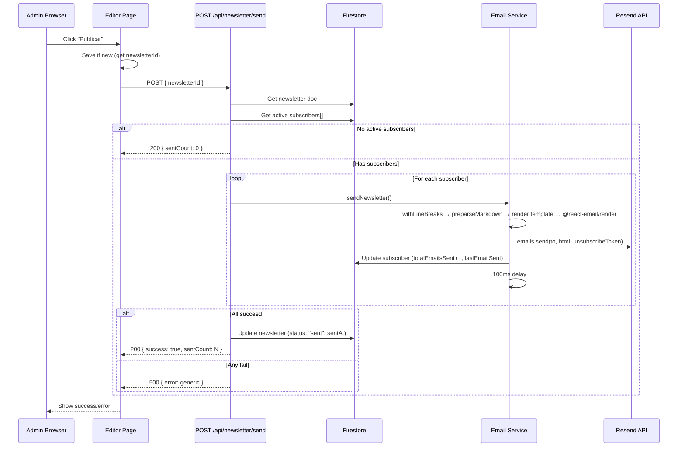

# Design: First Email Sending

## Technical Approach

Server-side email pipeline that reuses the existing `withLineBreaks` + `preparseMarkdown` chain, renders through a React Email template via `@react-email/render`, and delivers individually via Resend SDK. Client-side wiring enables the "Publicar" button in both editor pages to call a new protected API route.

```
Editor Preview (browser):  markdown → withLineBreaks() → preparseMarkdown() → ReactMarkdown + rehype-raw → browser HTML
Email Send (server):       markdown → withLineBreaks() → preparseMarkdown() → React Email template → @react-email/render → email HTML
```

Both pipelines share the pre-parser; only the render backend differs (client-side ReactMarkdown vs server-side React Email).

## Architecture Decisions

| Option | Tradeoffs | Decision |
|--------|-----------|----------|
| **React Email vs string templates** | String templates are simpler but break across email clients. React Email generates table-based layouts with inline styles that work in Outlook, Gmail, Apple Mail. | React Email — production-grade email compatibility |
| **All-or-nothing status** | Marking "sent" despite partial failures misleads admins. Keeping "draft" after any failure allows safe retry. | Newsletter stays "draft" if ANY subscriber fails |
| **Per-subscriber loop vs batch API** | Batch sends can't personalize unsubscribe tokens per recipient. Per-subscriber isolates failures and allows per-subscriber Firestore updates. | Individual sends with 100ms delay |
| **Pipeline parity** | Different preprocessors would cause visual drift between editor and inbox. Same pre-parser (pure function, no side effects) is safe to call on both client and server. | Shared `withLineBreaks` + `preparseMarkdown` |
| **Pre-parsed HTML injection** | Template receiving raw markdown duplicates parsing logic. Receiving pre-parsed HTML keeps the template as a structural wrapper only. | Template receives HTML via `dangerouslySetInnerHTML` (React Email standard pattern) |

## Sequence Diagram



## Data Flow

```
Editor "Publicar" click
  │
  ▼
fetch POST /api/newsletter/send
  │
  ├─ 1. Verify Firebase session cookie → 401 if invalid
  ├─ 2. Fetch newsletter from Firestore → 404 if missing
  ├─ 3. Check status !== "sent" → 409 if already sent
  ├─ 4. Query subscribers WHERE status = "active"
  ├─ 5. If empty → return { sentCount: 0 }
  │
  └─ email.sendNewsletter(newsletter, subscribers)
       │
       ├─ withLineBreaks(markdown)
       ├─ preparseMarkdown(result)
       ├─ <WeeklyNewsletter htmlContent={result} unsubscribeToken={...} />
       ├─ render(template) → email-safe HTML string
       │
       ├─ loop subscribers:
       │    ├─ render HTML with personal unsubscribeToken
       │    ├─ resend.emails.send({ from, to, subject, html })
       │    ├─ on success: update subscriber doc
       │    └─ wait(100ms)
       │
       └─ if all ok: update newsletter → { status: "sent", sentAt: now }
```

## File Changes

| File | Action | Description |
|------|--------|-------------|
| `package.json` | Modify | Add `resend` and `@react-email/render` deps |
| `.env.local` | Modify | Add `RESEND_API_KEY`, `RESEND_FROM_EMAIL` (user-managed) |
| `src/emails/templates/weekly-newsletter.tsx` | Create | React Email template: macOS header, content area (injected HTML), footer + unsubscribe |
| `src/lib/services/email.ts` | Create | Orchestrates pre-parsing, template rendering, Resend delivery, Firestore updates |
| `src/app/api/newsletter/send/route.ts` | Create | Protected POST route: auth check, newsletter validation, subscriber fetch, delegates to email service |
| `src/app/admin/editor/page.tsx` | Modify | Wire "Publicar" button: save-first-then-send flow, loading/success/error states |
| `src/app/admin/editor/[id]/page.tsx` | Modify | Wire "Publicar" button: direct send (already has ID), loading/success/error states |

## Interfaces / Contracts

```ts
// src/emails/templates/weekly-newsletter.tsx
interface WeeklyNewsletterProps {
  htmlContent: string;      // Pre-parsed, pre-rendered markdown HTML
  unsubscribeToken: string; // Per-subscriber token
}

// src/lib/services/email.ts
interface SendResult {
  sentCount: number;
  failedCount: number;
  failedEmails: string[];
}

interface Subscriber {
  email: string;
  name: string;
  unsubscribeToken: string;
  // ...other fields from Firestore
}

// POST /api/newsletter/send
// Request:  { newsletterId: string }
// Success:  { success: true, sentCount: number }
// Error:    { error: string, code?: string }
```

**Newsletter schema change**: Add `sentAt: Timestamp | null` to newsletters (Firebase Admin `Timestamp`).

## Testing Strategy

| Layer | What to Test | Approach |
|-------|-------------|----------|
| Unit | `withLineBreaks` + `preparseMarkdown` stability | Verify both pipelines produce same pre-parser output |
| Unit | Email template renders without crash | Render with mock `htmlContent` and `unsubscribeToken` |
| Integration | Send route auth guard | Mock session cookie, verify 401/404/409 responses |
| Integration | Email service with failed Resend | Mock Resend SDK to throw, verify newsletter stays "draft" |

## Migration / Rollout

No migration required. Existing newsletters remain "draft"; new `sentAt` field is nullable. Feature is additive — no changes to existing data or routes. Deployment: deploy normally via Vercel; set `RESEND_API_KEY` and `RESEND_FROM_EMAIL` in Vercel environment variables before first send.

## Open Questions

- [ ] Should we add a `lastSentAt` timestamp to the newsletter doc during send to track retry attempts, or is `sentAt` sufficient?
- [ ] Is the 100ms delay sufficient for Resend free tier rate limits (2 req/s)? May need adjustment.
